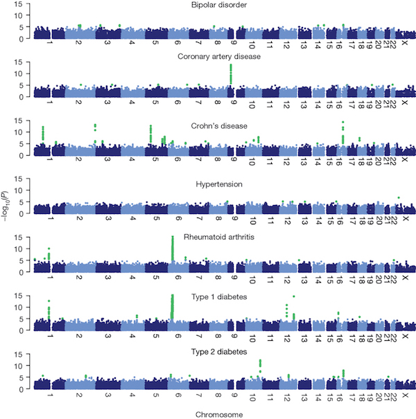

Lab 1: Genotype Imputation and Haplotype Phasing with IMPUTE2
============================================================
*Created by Max Winston; modified by Ittai Eres and Arjun Biddanda*

Section 1: Brief Recap on Genome-Wide Association Studies (GWAS)
----------------------------------------------------------------

GWAS is a fundamental tool for association between genotypes and phenotypes.
Phenotypes come in two general types: case-control and quantitative. The
general premise is to perform independent linear regression or a $\chi^2$ contingency table
at each variant and get an output of significance (p-values). For more of an introduction to 
GWAS methodology, see [here](http://journals.plos.org/ploscompbiol/article?id=10.1371/journal.pcbi.1002822)


The summary of these results is normally shown by a "Manhattan" plot, which plots the location of
the genetic variant against the $-log_{10}(p-value)$ of the single-variant association. GWAS
has been instrumental in determining the genetic basis of human diseases as well as traits in other
organisms.

*Manhattan plots for 7 diseases in the Wellcome Trust Case-Control Consortium*:



Another side note is that we are performing many independent tests (typically millions), of which 5% could be deemed
significant even if they are not associated variants and follow the null hypothesis. To combat this inflation in potential
false-positives, one technique that is used is Bonferroni correction. The premise behind Bonferroni correction is that we divide our significance threshold (e.g. $\alpha = 0.05$) by the number of independent statistical tests that we have performed ($n$). Alternatively, one could also mutliply the p-values that they obtain from GWAS by the number of tests and use the same $\alpha = 0.05$ significance cutoff.


Section 2: Introduction to Imputation
--------------------------------------
Genotype imputation relies on statistical inference and known haplotypes in a
population to estimate unobserved genotypes. Often, particularly in epidemiology
and quantitative genetics, a researcher may want to identify a specific location
in the genome where genetic variation is associated with a  phenotype, but they
may only have access to sparse genotype data (e.g. data from a SNP genotyping
array).

At the same time, dense genotype data may exist for a reference panel of
individuals (e.g. from the 1000 Genomes Project for humans). By leveraging the
information in the reference panel to impute genotypes into the inference panel,
a researcher can interrogate more variants for association with the trait.  In
some cases, this reveals associations that would not be detected directly in the
sparse data. In other cases, it may help refine the location of a causal
variant.

The imputation process relies on haplotype phasing, which is the statistical
estimation of haplotypes from genotype data. Both of these steps can be
accomplished from within IMPUTE2, and will be the focus of today's lab. By the
end of the lab you should be able to:

- **Understand basic workflow and syntax of IMPUTE2**
- **Execute basic imputation in IMPUTE2**
- **Navigate basic commands for file conversion using PLINK2**
- **Understand key assumptions of imputation**
- **Utilize IMPUTE2 and PLINK to search for putative associations in imputed SNPs**

*Basic schematic of SNP imputation (Howie & Marchini, 2009):*


Section 3: Basics of IMPUTE2
-------------------------------

<!-- TODO : Unclear if we need this section here awk and paste are the only ones.. -->
### *1.1: BASH commands useful for this lab*

Command      Description
-------      -----------
**paste**    Merges lines of files together.
**wc**       Word, line, character, and byte count.
**mkdir**    Make directory.
**head**     Output first part of files.
**awk**      Sets of commands useful for interacting with data tables

### *1.2: Standard IMPUTE2 arguments*

Argument       Input Type      Description    
--------       ----------      -----------
**-g**         .gens           File containing study genotypes needing imputation or phasing.
**-m**         .map            Fine-scale recombination map for the region to be analyzed.
**-int**       [*interval*]    Genomic interval to use for imputation inference.
**-h**         .haps           File of known haplotypes, with one row per SNP and one column per haplotype (alleles must be coded 0 or 1)
**-l**         .legend         Legend file(s) with information about the SNPs in the haplotypes file.
**-strand_g**  .strand         File containing strand orientation of the inference set.
**-Ne**        [*pop size*]    Parameter controlling effective population size.

### *1.3: File formatting for IMPUTE2*

There are several file formats necessary for IMPUTE2, which are listed above in
Section 1.2. It is helpful to understand the basic formatting for these input
files and their importance in the imputation, as this well facilitate
manipulating them in the future.

#### *1.3.1: GENS file*

The GENS file is the general file type for genotype data in IMPUTE2. Each row
represents a different SNP, and the first five columns are: (1) **SNP ID**, (2)
**rsID**, (3) **Position (bp)**, (4) **Major Allele**, (5) **Minor Allele**. The
sixth column onward represents the genotypic information for all of the
individuals, where each individual has three columns representing the
probabilities of each genotype. N.B. that this file does NOT have a header row.

#### *1.3.2: MAP file*

The MAP file was introduced in Lab 1, but to review, the mapping file provides a
fine-scale recombination map with three columns: (1) *physical position (in base
pairs)*, (2) *recombination rate between current position and next position in
map (in cM/Mb)*, (3) *and genetic map position (in cM)*. This information is
critical in the process of imputation in that altering rates of recombination in
a region will significantly change the likelihoods for imputed SNPs. For
example, if there are high rates of recombination between SNP A from your SNP
array and desired imputed SNP B, you may have less statistical power or
certainty to impute that SNP depending on the depth of your reference
haplotypes. Note that this file DOES have a header row. You can always check if
a file has one (and you should need to a few times in this lab) simply by
opening it with your text editor of choice.

*Problem 1* All the files that begin with the label "example.chr22" are from a
particular stretch of DNA on chromosome. What position in this stretch has the
highest recombination rate? What is it (please include units)?

#### *1.3.3: HAPS file*

The HAPS file is a file of reference haplotypes (usually binary), often from a
larger project (i.e. 1000 Genomes), which is used during imputation to compare
against haplotypes from the inference panel to estimate probabilities for
imputed SNPs. Each line represents a distinct haplotype to be used as a
reference.

*Problem 2* How many haplotypes are provided in the example file *example.chr22.1kG.haps*?

#### *1.3.4: LEGEND file*

The LEGEND file provides information on the HAPS file, so there must be a
one-to-one correspondence. Thus, it is generally not wise to edit the HAPS or
the LEGEND file, but if you were to do this you would need to edit them in
concert. Each LEGEND file provides four columns of information, with each row
corresponding to the same row in the HAPS file. The four columns of information
are: (1) **rs ID**, (2) **Position (bp)**, (3) **Major Allele**, (4) **Minor Allele**.

*Problem 3* What is the major allele for SNP "rs1669115"? What is the minor
allele?

#### *1.3.5: STRAND file*

The STRAND file is a pretty simple but critical file that ensures the reference
set and the inference set are comparing the same strand of DNA (similar 5' to 3'
distinction). This avoids confusion about ambigous genotype calls -- for
example, what one investigator calls a GG call could be called a CC by another
investigator looking at the opposing strand of DNA. To denote which strand we
use relative to the human reference sequence, a "+" denotes the same strand as
the reference genome, and a "-" denotes the opposing strand. There are only two
columns: (1) **Position (bp)**, (2) **Strand**. You really shouldn't be altering
this file unless completely necessary, as it can introduce some very big errors.
Although this won't be necessary for today's lab, it is essential to have the
strand matched between the reference and imputation panel when imputing data and
one should be on guard for "strand flips" as an explanation for anomolous
results.

### *1.5: Running the imputation*

For getting the hang of running IMPUTE2, we will be imputing the area on the
22nd chromosome between the SNPs sequenced in the example files
*"example.chr.study"*. These files specify the necessary information for our
**inference panel**. Likewise, we have a **reference panel** in this same region
specified in the files starting with *"example.chr22.1kG"*:

```{r, eval=FALSE}

impute2 -m data/Example/example.chr22.map -h data/Example/example.chr22.1kG.haps -l data/Example/example.chr22.1kG.legend -g data/Example/example.chr22.study.gens -strand_g data/Example/example.chr22.study.strand -int 20.3e6 0.6e6 -Ne 20000 -o data/Example/example.chr22.one.phased.impute2
```

You can either type out this command all on one line or you can save it to a
script. Note that the command above implicitly assumes that you are in the main
directory of the project (*IMPUTE2_Exercise*), and where you can see the *data/*
directory listed out. This should create five files in the specified directory
(*data/Example/*), all of which should start with
*"example.chr22.one.phased.impute2"*.

The file with the actual imputed genotypes in GENS format should be the file
*just* called *"example.chr22.one.phased.impute2"*. Other supplementary output
files have underscores and then IDs: **"warning"** gives any errors during the
imputation process, **"summary"** is just a log file, **"info"** gives a variety
of information for each SNP as demonstrated in the header, and **"info by
sample"** gives information by individuals instead of by SNP.

If you are having difficulty with the impute2 commands above, there is a file in
the *src/* directory that will enable you to generate the required output
without any trouble. To run this script run the following commands from the main
directory:

```{r, eval=FALSE}
cd src/
bash run_imputation.sh
cd ..
```


*Problem 4* Open the summary file
(*data/Example/example.chr22.one.phased.impute2_summary*) in a text editor and
scroll down to line 60 (L60), where it should mention 'flipping strands'. What
does it say and how would you interpret this?

<!-- TODO : WORKING  -->

### *1.6: Converting IMPUTE2 files to PLINK format*

The newest version of PLINK (v1.9.0) is an incredibly versatile tool for the analysis of genetic data. One of the best features is that it allows a user to convert between many different file formats, something we would like to do in order to run an association analysis on our newly imputed data.The program is well documented, and it is recommended that you visit the documentation on the website for any purposes outside this lab (https://www.cog-genomics.org/plink2).


#### *1.6.2: Basic PLINK2 File Conversion*

Here we will practice using PLINK2 on one of the small GENS files with only 33
markers from the IMPUTE2 *"data/Example/"* directory, *"example.chr22.study.gens"*.
We will need to provide this file, as well as a list of samples
*"example.study.samples"* in the same directory.


```{r, eval=FALSE}

plink2 --gen data/Example/example.chr22.study.gens --sample data/Example/example.study.samples --hard-call-threshold 0.1 --recode --out data/plink_files/real_small

```


If you get an error, it is likely because the first column of *data/Example/example.chr22.study.gens* does not indicate the chromosome number!  We can use the following set of commands to create a temporary gens file that is corrected for this and get our desired output.

```{r, eval=FALSE}
awk '{$1=22; print $0}' data/Example/example.chr22.study.gens > tmp.gens
plink2 --gen tmp.gens --sample data/Example/example.study.samples  --hard-call-threshold 0.1 --recode --out data/plink_files/real_small
rm tmp.gens
```


<!-- WORDING here... -->
One important parameter is the **"--hard-call-threshold"** argument. This tells PLINK the likelihood cut-off for a genotype at any given SNP. For example, in our command, any likelihood below 0.9 at a given SNP will produce a "missing genotype" for PLINK. If you wanted to be extra certain you could provide a value of 0.05 or 0.01 for this parameter.

*Problem 5* Recalling your knowledge of the structure of PED files, what do you
notice about both the phenotype and gender information in the file we just
converted ("real_small.ped")?

Section 2: Simulating a Case-Control Scenario with Imputation
-------------------------------------------------------------

In this section we will use the skills we have learned in the first section to
simulate a scenario in which you have localized a region through previous work
on the 22nd chromosome that is associated with Disease XXX. You will need to use
PLINK, IMPUTE2, and BASH commands to work through this scenario, in
which you will run an association, identify the SNP on your array, convert data
to IMPUTE2 format, and impute unobserved SNPs for another association in an
attempt to get a more precise estimate of the associated SNP.

## *2.1: Running an initial GWAS*

Here, you will run an initial GWAS on a set of 33 markers in the file
*"real_small"*. For the sake of this exercise, assume that these 33
markers restricted to a small section of chromosome 22 (20303319-20596808bp) are
part of a larger GWAS that you ran with a total of 100,000 SNPs. In that study,
you identified this region, and now you want to pursue your study further with
imputation. Just to check that everything is working correctly, you want to
check the reduced set (33 markers) with a GWAS.

## *2.1.1: Creating a Phenotypes File*

One important thing that we have missed is creating a phenotypes file (in *data/plink_files/real_small.ped* the phenotypes column is all missing!). A PLINK formatted phenotype file has the the first column as the family ID (or population), the second column having the within-family ID, and the third column having the phenotype (1="control", 2 = "case"). We already have the list of phenotypes in *data/plink_files/pheno.txt*, but without the first two columns that we need. By using the following command we can create our appropriate phenotype file

```{r, eval=FALSE}
awk '{print $1,$2}' data/plink_files/real_small.ped | paste - data/plink_files/pheno.txt > data/plink_files/real_small.pheno
```


## *2.1.2: Running a basic Association*

In order to run a basic association in PLINK, we will use the *--assoc* flag. If we call the following from the main directory we will be able to run a basic case-control analysis on the original genotyping data (using our new phenotype file!)

```{r, eval=FALSE}
plink2 --file data/plink_files/real_small --pheno data/plink_files/real_small.pheno --allow-no-sex --assoc --out results/gwas_array
```

The output files from this command should be in the *results* directory, and should all have the prefix of *gwas_array*.

*Problem 8* According to this analysis, what is the most highly associated SNP?
What is the unadjusted p-value? Considering what you know about how we found
this SNP (see above), what do you think the Bonferroni-correction should be?


### *2.2: Manhattan plot of initial GWAS*

*Problem 9* Export the *.assoc* file and produce a Manhattan plot in RStudio. Make sure to use the appropriate
Bonferroni-correction (think about how you identified this region as well) for the Manhattan plot.

### *2.3: Imputation and File Conversion*

Imputation for this set of 33 markers was completed in Section 1.5. The file you
produced should be called **"example.chr22.one.phased.impute2"**. Let's take
this GENS file and convert it to PED format.

*Problem 10*
Using the commands provided in section 1.6.2 above as a guide, write a second command to
convert the file *data/Example/example.chr22.one.phased.impute2* to PED format and name this output *real_small_imputed* and place the output in the *data/plink_files/* directory.

Finally, we need to modify this PED file to insert our phenotype into it.

*Problem 11*
Using the steps of section 2.1.1, create a phenotype file for the *real_small_imputed* dataset. Note that you will have to use the awk command, but make sure that the output file is named properly (the name should be *real_small_imputed.pheno*)

### *2.4: Running a GWAS with Imputed SNPs*

Once you have your converted and reformatted PED and MAP files named
*"real_small_imputed"*, we can now run a basic GWAS with these imputed SNPs GWAS.

*Problem 12* Run a basic association on the *real_small_imputed* files (using the steps from 2.1.2). Save the output to *results/gwas_imputed.assoc*.

*Problem 13* Use your BASH knowledge to find the most highly associated SNP in
the *"real_test.assoc"* file. What SNP is it? What is the non-adjusted p-value?

### *2.5: Manhattan Plot of Imputed GWAS*

Lastly, we will visualize the results of our GWAS with imputed SNPs by exporting
our *"real_test.assoc"* file to our computer and plot it using RStudio.

*Problem 14* Similar to Problem 9, produce a Manhattan plot for the *results/gwas_imputed.assoc* in
RStudio. Describe the differences between this plot and the plot from Problem 9
in a couple of sentences.

*Optional Exercise* Examine how the associations change if you carry out the
association analysis using the dosage data (--dosage option of plink) and/or
using the posterior probabilites of each imputed genotype (using for example the
SNPTEST software).


Other Imputation Resources
---------------------------
 - [EAGLE](https://www.hsph.harvard.edu/po-ru-loh/software/)
 - [Michigan Imputation Server](https://imputationserver.sph.umich.edu/index.html)

References
----------------------------

**B. N. Howie, P. Donnelly, and J. Marchini (2009).**
A flexible and accurate genotype imputation method for the next generation of genome-wide association studies. *PLoS Genetics* 5(6): e1000529

**The Wellcome Trust Case-Control Consortium (2007).**
Genome-wide association study of 14,000 cases of seven common diseases and 3,000 shared controls. *Nature*
